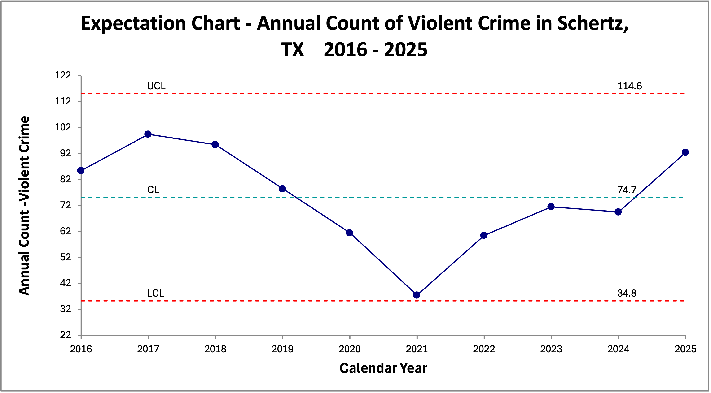
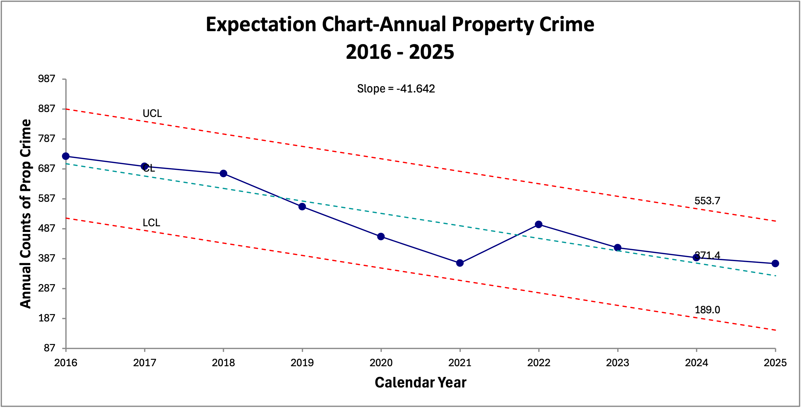
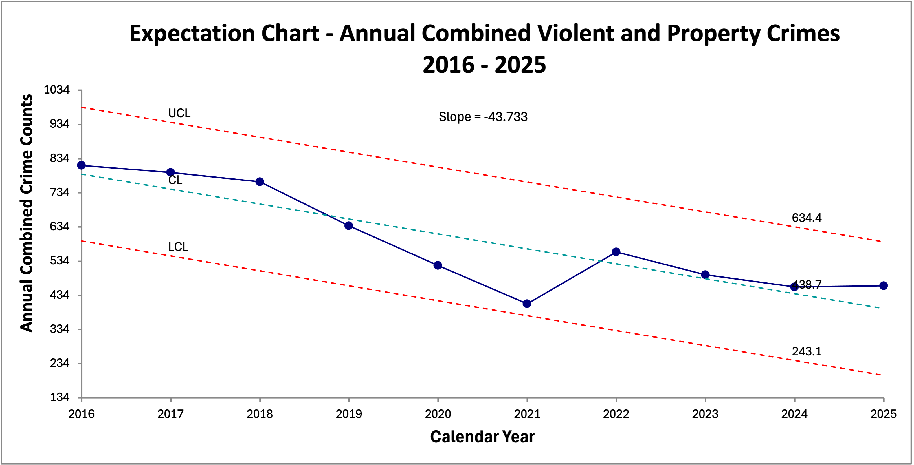

```{r}
#| label: setup
#| include: false

# Capture current filename for use in document
file_name <- if (!base::is.null(knitr::current_input())) {
  paste0(tools::file_path_sans_ext(knitr::current_input()), ".qmd")
} else {
  "interactive_session.qmd"
}

file_stem <- base::paste0(tools::file_path_sans_ext(file_name), "_chat")


# install.packages(c("mapview", "survey", "srvyr", "arcgislayers"))

# census_api_key("95496766c51541ee6f402c1e1a8658581285b759", install = TRUE, overwrite = TRUE)


# # load libraries - NOT NEEDED

# Download button helpers live here; knitr::is_html_output() guard is inside
# the helpers so they silently no-op when rendering to typst

source(here::here("R", "report_format_helpers.R"))
source(here::here("R", "flextable_helpers.R"))
source(here::here("R", "download_button_helpers.R"))

fmt_num <- function(x, digits = 0) {
  formatC(x, format = "f", digits = digits, big.mark = ",")
}

# Force dplyr's select to take precedence
select <- dplyr::select
filter <- dplyr::filter

# Options
options(scipen = 999)
options(qic.clshade = T) # NO LONGER NEEDED; CHARTS ALL PREPARED WITH GGPLOT2 ONLY
options(qic.linecol = 'black') # NO LONGER NEEDED; CHARTS ALL PREPARED WITH GGPLOT2 ONLY
options(qic.signalcol = "firebrick") # NO LONGER NEEDED; CHARTS ALL PREPARED WITH GGPLOT2 ONLY
options(qic.targetcol = "purple") # NO LONGER NEEDED; CHARTS ALL PREPARED WITH GGPLOT2 ONLY
options(DT.options = list(dom = 'pBlfrti')) # Add buttons, filtering, and top (t) pagination controls
options(shiny.maxRequestSize = 50 * 1024^2) # Set upload maximum to 50 MB
options(tigris_use_cache = TRUE)
options(device = "RStudioGD") 


# Flextable defaults:
flextable::set_flextable_defaults(
  font.size = 14, 
  font.family = "Cabin",
  font.color = "black",
  table.layout = "fixed",
  border.color = "darkgray",
  padding.top = 3, padding.bottom = 3,
  padding.left = 4, padding.right = 4,
  line_spacing = 1.3,
  digits = 2,
  decimal.mark = ".",
  big.mark = " ",
  na_str = "<na>",
  theme_fun = base::identity,          # <-- add this
  post_process_html = identity,
  post_process_docx = identity
)

# Standard table styler: blue italic title row + palegreen column header row.
# Defined here so all QMDs that source this setup get the same presentation
# without depending on census_helpers.R for a purely cosmetic function.
ds_style_flextable <- function(ft, title = NULL, title_size = 16) {
  # Fixed layout helps long text wrap instead of expanding columns
  ft <- flextable::set_table_properties(ft, layout = "fixed")

  if (!base::is.null(title)) {
    ft <- flextable::add_header_lines(ft, values = title)
    ft <- flextable::color(ft, i = 1, part = "header", color = "blue")
    ft <- flextable::italic(ft, i = 1, part = "header")
    ft <- flextable::align(ft, i = 1, part = "header", align = "left")
    ft <- flextable::bold(ft, i = 1, part = "header")
    ft <- flextable::fontsize(ft, i = 1, part = "header", size = title_size)
    ft <- flextable::bg(ft, i = 1, part = "header", bg = "white")
    ft <- flextable::bg(ft, i = 2, part = "header", bg = "palegreen")

    # Optional: make wrapped titles read better
    ft <- flextable::line_spacing(ft, i = 1, part = "header", space = 1.2)
  } else {
    ft <- flextable::bg(ft, i = 1, part = "header", bg = "palegreen")
  }

  ft <- flextable::autofit(ft)
  ft
}


# Set global theme for consistent plots
ggplot2::theme_set(
  ggplot2::theme_minimal(base_size = 20) +
    ggplot2::theme(
      plot.title.position = "plot",
      plot.title = ggtext::element_textbox_simple(
        family = "Cabin",
        face = "bold",
        color = "darkgreen",
        size = 28,
        fill = "yellow",
        lineheight = 0.9,
        padding = ggplot2::margin(5.5, 5.5, 0.0, 5.5),
        margin = ggplot2::margin(0, 0, 5.5, 0)
      ),
      plot.subtitle = ggtext::element_textbox_simple(
        family = "Cabin",
        color = "darkgreen",
        face = "bold",
        size = 22,
        fill = "yellow",
        lineheight = 0.9,
        padding = ggplot2::margin(5.5, 5.5, 5.5, 5.5),
        margin = ggplot2::margin(0.0, 0, 5.5, 0)
      ),
      plot.caption = ggtext::element_markdown(
        family = "Cabin",
        size = 18,
        hjust = 1,
        color = "darkblue",
        face = "italic",
        fill = "yellow",
        lineheight = 1.0
      ),
      axis.text.x = ggtext::element_markdown(
        family = "Cabin",
        face = "bold",
        color = "blue",
        size = 18,
        angle = 45,
        hjust = 1
      ),
        # ggplot2::element_blank(),
      axis.title.x = ggtext::element_markdown(
        family = "Cabin",
        face = "bold",
        color = "blue",
        size = 18),
        # ggplot2::element_blank(),
      axis.text.y = ggtext::element_markdown(
        family = "Cabin",
        face = "bold",
        color = "blue",
        size = 18,
        angle = 45,
        hjust = 1
      ),
        # ggplot2::element_blank(),
      axis.title.y = ggtext::element_markdown(
        family = "Cabin",
        face = "bold",
        color = "blue",
        size = 12),
        # ggplot2::element_blank(),
      strip.text = ggtext::element_markdown(
        family = "Cabin",
        color = "black",
        size = 18,
        face = "italic",
        margin = ggplot2::margin(2, 0, 0.5, 0, "lines")
      ),
      axis.text = ggtext::element_markdown(
        family = "Cabin",
        color = "black"),
      panel.background = ggplot2::element_rect(fill = "white", color = NA),
      plot.background = ggplot2::element_rect(fill = "white", color = NA),
      legend.position = "none",
      panel.spacing.x = grid::unit(1.5, "cm"),
      panel.spacing.y = grid::unit(1.5, "cm"),
      plot.margin = ggplot2::margin(20, 20, 20, 20, "pt")
    )
)


# claude <- ellmer::chat_anthropic(model = "claude-opus-4-6-20260205")
  
# Set seed for reproducibility
base::set.seed(123)

```

\

#### **Filename:**

::: {.content-visible when-format="html"}
[`r file_name`]{style="word-break: break-all; font-size: 1.00em;"}
:::

```{=typst}
#let wrap_underscores(s) = s.replace("_", "_\u{200B}")
#text(size: 16pt)[#raw(wrap_underscores("`r file_name`"))]
```
\

## Research Question

Is the Schertz Police Department under a significantly increased crime load now than in the past?

Data are separated as to:

-   violent crime

-   property crime

-   combined crime

## Import and validate Sheet 1

```{r}
#| label: import-and-validate

crime_wide <- readxl::read_excel(
  "Schertz Tx Monthly Property and Violent Crime Combined FBI Query Results_03-07-2026.xlsx",
  sheet = 1
) |>
  dplyr::transmute(
    Date = as.Date(Date),
    Violent_Crimes = as.numeric(`Violent Crimes`),
    Property_Crimes = as.numeric(`Property Crimes`),
    Combined = as.numeric(Combined)
  ) |>
  dplyr::filter(
    !base::is.na(Date),
    !base::is.na(Violent_Crimes),
    !base::is.na(Property_Crimes),
    !base::is.na(Combined)
  ) |>
  dplyr::arrange(Date) |>
  dplyr::mutate(
    Year = base::as.integer(base::format(Date, "%Y")),
    Month = base::as.integer(base::format(Date, "%m")),
    Combined_Check = Violent_Crimes + Property_Crimes,
    Combined_Matches = Combined == Combined_Check
  )

validation_df <- data.frame(
  Item = c(
    "First month in Sheet 1",
    "Last month in Sheet 1",
    "Rows imported",
    "Combined equals Violent + Property on every row?"
  ),
  Value = c(
    as.character(base::min(crime_wide$Date)),
    as.character(base::max(crime_wide$Date)),
    base::format(base::nrow(crime_wide), big.mark = ","),
    ifelse(base::all(crime_wide$Combined_Matches), "YES", "NO")
  ),
  stringsAsFactors = FALSE
)

validation_spec <- list(
  title = "Sheet 1 Import Validation",
  labels = list(Item = "Item", Value = "Value")
)

ds_ft(validation_df, validation_spec)

ds_download_data_btn(
  crime_wide,
  filename_base = base::paste0(file_stem, "_crime_wide_imported"),
  label = "Download Imported Crime Data (CSV)"
)
```

```{r}
#| label: reshape-data

crime_long <- crime_wide |>
  dplyr::select(Date, Year, Month, Violent_Crimes, Property_Crimes, Combined) |>
  tidyr::pivot_longer(
    cols = c(Violent_Crimes, Property_Crimes, Combined),
    names_to = "Crime_Type",
    values_to = "Count"
  ) |>
  dplyr::mutate(
    Crime_Type = factor(
      Crime_Type,
      levels = c("Violent_Crimes", "Property_Crimes", "Combined"),
      labels = c("Violent Crimes", "Property Crimes", "Combined")
    )
  )

crime_long_full_years <- crime_long |>
  dplyr::filter(Year <= 2025)

annual_summary <- crime_long_full_years |>
  dplyr::group_by(Crime_Type, Year) |>
  dplyr::summarise(
    Annual_Total = base::sum(Count, na.rm = TRUE),
    Avg_Monthly = base::mean(Count, na.rm = TRUE),
    Median_Monthly = stats::median(Count, na.rm = TRUE),
    Max_Month = base::max(Count, na.rm = TRUE),
    Min_Month = base::min(Count, na.rm = TRUE),
    .groups = "drop"
  ) |>
  dplyr::group_by(Crime_Type) |>
  dplyr::mutate(
    YoY_Pct = (Annual_Total / dplyr::lag(Annual_Total) - 1) *1
  ) |>
  dplyr::ungroup()
```

\

### The FBI obtains data from Schertz Police Department and according to FBI data:  


[***THERE IS NO INCREASE IN VIOLENT CRIME in Schertz,TX.***]{style="color: blue;"}

It has been in a [***stable steady state***]{style="color: firebrick;"} averaging 75 crimes per year since at least 2016

{width="100%"}

\
\

### According to the same FBI data 


[***THERE IS NO INCREASE IN PROPERTY CRIME in Schertz, TX.***]{style="color: blue;"}

In fact, it has been in [***steady DECLINE***]{style="color: firebrick;"} since at least 2016

{width="100%"}

\
\

### According to the same FBI data

[***THERE IS NO INCREASE IN TOTAL VIOLENT AND PROPERTY CRIME in Schertz, TX***]{style="color: blue;"}

In fact, it has been in [***steady DECLINE***]{style="color: firebrick;"} since at least 2016


{width="100%"}


## What the data says at a high level

```{r}
#| label: key-findings-table

period_summary <- crime_long_full_years |>
  dplyr::group_by(Crime_Type) |>
  dplyr::summarise(
    Avg_2016_2019 = base::mean(Count[Year <= 2019], na.rm = TRUE),
    Avg_2020_2023 = base::mean(Count[Year >= 2020 & Year <= 2023], na.rm = TRUE),
    Avg_2024_2025 = base::mean(Count[Year >= 2024], na.rm = TRUE),
    Peak_Annual = base::max(annual_summary$Annual_Total[annual_summary$Crime_Type == dplyr::first(Crime_Type)], na.rm = TRUE),
    Peak_Year = annual_summary$Year[
      annual_summary$Crime_Type == dplyr::first(Crime_Type) &
      annual_summary$Annual_Total == base::max(annual_summary$Annual_Total[annual_summary$Crime_Type == dplyr::first(Crime_Type)], na.rm = TRUE)
    ][1],
    Trend_Direction = dplyr::case_when(
      Avg_2024_2025 > Avg_2016_2019 ~ "Higher than 2016-2019 baseline",
      Avg_2024_2025 < Avg_2016_2019 ~ "Lower than 2016-2019 baseline",
      TRUE ~ "About the same as baseline"
    ),
    .groups = "drop"
  ) |>
  dplyr::mutate(
    Avg_2016_2019 = fmt_num(Avg_2016_2019, 1),
    Avg_2020_2023 = fmt_num(Avg_2020_2023, 1),
    Avg_2024_2025 = fmt_num(Avg_2024_2025, 1),
    Peak_Annual = paste0(fmt_num(Peak_Annual, 0), " (", Peak_Year, ")")
  ) |>
  dplyr::rename(
    `Crime Type` = Crime_Type,
    `Avg Monthly 2016-2019` = Avg_2016_2019,
    `Avg Monthly 2020-2023` = Avg_2020_2023,
    `Avg Monthly 2024-2025` = Avg_2024_2025,
    `Peak Annual Total` = Peak_Annual,
    `Current vs Earlier Baseline` = Trend_Direction
  )

period_summary_spec <- list(
  title = "High-Level Comparison of Earlier vs Recent Crime Load"
)

ds_ft(period_summary, period_summary_spec)

ds_download_data_btn(
  period_summary,
  filename_base = base::paste0(file_stem, "_period_summary"),
  label = "Download Period Summary (CSV)"
)
```

\

### Substantive reading of the table

The simplest reading is:

-   **Property crime is the dominant load driver** in the file.

-   **Property crime is materially lower now** than in the earlier part of the series.

-   **Combined crime is also materially lower now** than in the earlier part of the series.

-   **Violent crime does not show a strong current surge** relative to the full history. It fluctuates, but recent values are not clearly above the earlier baseline.

\


```{r}
#| label: annual-summary-table

annual_display <- annual_summary |>
  dplyr::mutate(
    Annual_Total = fmt_num(Annual_Total, 0),
    Avg_Monthly = fmt_num(Avg_Monthly, 1),
    Median_Monthly = fmt_num(Median_Monthly, 1),
    Max_Month = fmt_num(Max_Month, 0),
    Min_Month = fmt_num(Min_Month, 0),
    YoY_Pct = dplyr::if_else(
      base::is.na(YoY_Pct),
      "",
      fmt_pct(YoY_Pct, 1)
    )
  ) |>
  dplyr::rename(
    `Crime Type` = Crime_Type,
    `Year` = Year,
    `Annual Total` = Annual_Total,
    `Avg Monthly` = Avg_Monthly,
    `Median Monthly` = Median_Monthly,
    `Max Month` = Max_Month,
    `Min Month` = Min_Month,
    `YoY % Change in Annual Totals` = YoY_Pct
  )

annual_display_spec <- list(
  title = "Annual Summary by Crime Type"
)

ds_ft(annual_display, annual_display_spec)

ds_download_data_btn(
  annual_summary,
  filename_base = base::paste0(file_stem, "_annual_summary"),
  label = "Download Annual Summary (CSV)"
)
```


## Substantive findings

### 1. IF property crime is a significant workload driver, it is lower now than in earlier years.  

***Conclusion:***  There is no evidence workload has increased 2016-2025.

Property crime accounts for most of the monthly crime load in Schertz, TX. Its trend is plainly downward. The recent 2024-2025 monthly average is well below the earlier 2016-2019 baseline.


### 2. Violent crime does not show a convincing current surge.

Violent crime is a smaller-volume series with more month-to-month fluctuation. But the recent period does not appear to be materially above the earlier baseline. In other words, this file does not support the claim that Schertz PD is now facing a significantly increase in workload due to violent-crime.


### 3. Combined crime is also lower now than in the earlier years.

Because property crime dominates the total, the combined series also trends downward. The recent combined monthly average is substantially lower than the earlier baseline.


### 4. The broad answer to the research question is no.

Based on the FBI evidence, the department does **not** appear to be under significantly increased crime load now than in the past.

If anything, the clearer signal is:

-   **lower property crime load**  

-   **lower combined crime load**  

-   **violent crime that fluctuates, but not at a clearly elevated recent level**  


## Bottom line

If staffing arguments are being made on the basis of significantly increased crime load, this evidence does **not** provide support for that claim.

The file instead suggests:

-   the long-run burden from **property crime** is lower than earlier  

-   **violent crime** should be watched, but it does not appear to establish a materially higher present-day load by itself.  Only an Expectation Chart can provide reliable trend analysis.  

-   the **combined** crime series is lower than earlier  


